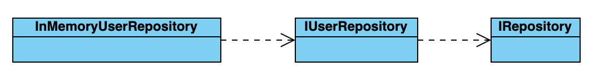
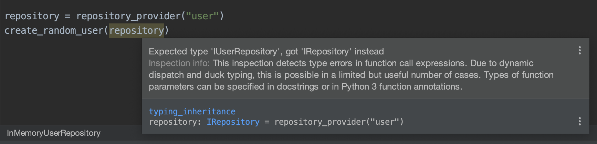

# typing-inheritance-example 👪

[This](typing_inheritance.py) example implements a dummy code to represent a double inheritance.

See diagram:



It seems PyCharm warn us about unresolved double inheritance in Python.



If use mypy:

```console
mypy typing_inheritance.py             
typing_inheritance.py:71: error: Argument 1 to "create_random_user" has incompatible type "IRepository"; expected "IUserRepository"
Found 1 error in 1 file (checked 1 source file)
```


As [Python-Vigo](https://www.python-vigo.es/) colleagues recommended, using a dynamic `TypeVar` hinting we can resolve this issue.

Check the solution in [typing_inheritance_with_typevar](typing_inheritance_with_typevar.py). 

Source to obtain every inheritors from specific class [stackoverflow](https://stackoverflow.com/questions/5881873/python-find-all-classes-which-inherit-from-this-one)

If we check now with mypy:

```console
$ mypy typing_inheritance_with_typevar.py
typing_inheritance_with_typevar.py:79: error: Unexpected argument to TypeVar()
typing_inheritance_with_typevar.py:82: error: Variable "typing_inheritance_with_typevar.Repository" is not valid as a type
typing_inheritance_with_typevar.py:82: note: See https://mypy.readthedocs.io/en/latest/common_issues.html#variables-vs-type-aliases
Found 2 errors in 1 file (checked 1 source file)
```

It seems, I'm doing something wrong declaring the `TypeVar`


I tried with the following, but I should try it again with more time :)

```python
from typing import TypeVar

def inheritors(klass):
    subclasses = []
    work = [klass]
    while work:
        parent = work.pop()
        for child in parent.__subclasses__():
            if child not in subclasses:
                subclasses.append(child)
                work.append(child)
    return tuple([TypeVar(subclass.__name__, bound=subclass) for subclass in subclasses])
```


